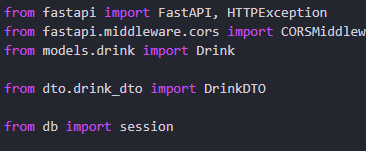
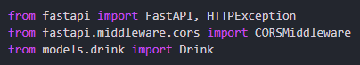
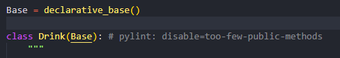

# ANÁLISIS ESTÁTICO DEL CÓDIGO - BEBIDAS CON FASTAPI

## Descripción
Este documento contiene el reporte del análisis estático realizado al proyecto **API_BEBIDAS** utilizando herramientas como **Pylint**, **Mypy** y **Coverage.py**.

## Herramientas Utilizadas
- **Pylint**: Para verificar la calidad del código y adherencia a PEP 8.
- **Mypy**: Para análisis de tipos estáticos.
- **Coverage.py**: Para medir la cobertura de pruebas.

## Reporte Realizado con Pylint
Las siguientes son algunas de las advertencias identificadas y corregidas usando la herramienta de **Pylint**

### **- Módulo main:**

**1. Missing module docstring:**

Esta fue una de las advertencias mas reiterativas en los módulos que fueron analizados por **Pylint**, y la cual se refiere a que hacen falta docstrings o comentarios en formato de cadena que describan el proposito de un módulo, clase o método. En este caso se corrigio la advertencia referente a la falta de docstrings en el módulo analizado.

```
main.py:1:0: C0114: Missing module docstring (missing-module-docstring)
```

La anterior advertencia se corrigio agregando un comentario (docstring) al principio del módulo main:


También se agregaron los comentarios correspondientes a cada uno de los métodos que hay en el módulo main, siguiendo un proceso similar al mencionado anteriormente.

```
main.py:21:0: C0116: Missing function or method docstring (missing-function-docstring)
main.py:34:0: C0116: Missing function or method docstring (missing-function-docstring)
main.py:40:0: C0116: Missing function or method docstring (missing-function-docstring)
```

**2. Third party import:**

Esta advertencia se refiere a que la importación del módulo que permite configurar el CORS en la aplicación de FastAPI, al ser de un tercero, debe de estar ubicado antes de los imports de módulos propios.

```
main.py:3:0: C0411: third party import "fastapi.middleware.cors.CORSMiddleware" should be placed before first party import "models.drink.Drink"  (wrong-import-order)
```

La corrección a la anterior advertencia se puede ver en la siguiente imagen:


**3. Ungrouped-imports:**

Esta advertencia hace referencia a que las importaciones del paquete de FastAPI no se encuentran agrupadas, por lo que las importaciones de un mismo paquete siempre deben de estar agrupadas entre ellas.

```
main.py:3:0: C0412: Imports from package fastapi are not grouped (ungrouped-imports)
```

La corrección de la anterior advertencia se hizó de la siguiente forma.



### **- Módulo db:**

**1. Trailing whitespace:**

Esta advertencia indica que en la línea 10 del módulo db hay un espacio en blanco entre las líneas de código, por lo que esta se soluciona borrando los espacios que hay demás.

```
db.py:10:25: C0303: Trolling whitespace (trailing-whitespace)
```

**2. Missing Final Newline:**

Esta advertencia se presenta cuando no se termina el código de un módulo con un salto de línea, por lo que este se resuelve agregando el salto de línea.

```
db.py:16:0: C0304: Final newline missing (missing-final-newline)
```

A parte de las anteriores advertencias, también se corrigieron aquellas relacionadas con los docstrings.

### **- Módulo drink**:

En este módulo también se corrigieron las advertencias sobre la falta de docstrings. 

### **- Módulo drink_dto**:

**1. Invalid Name:**

Esta advertencia se presenta cuando el nombre de un archivo, no cumple con el formato de snake_case recomendado, por lo que esta advertencia se corrigió cambiando el nombre del archivo DrinkDTO por drink_dto.

```
dto\DrinkDTO.py:1:0: C0103: Module name "DrinkDTO" doesn't conform to snake_case naming style (invalid-name)
```

También en este módulo se corrigieron las advertencias relacionadas con la falta de docstrings.

### **Reglas desactivadas**

#### **- Módulo drink**:

**1. Too few public methods:**

Esta advertencia hace referencia a que la clase Drink que esta dentro del modulo drink tiene muy pocos métodos públicos, en este caso tiene 0/2, ya que Pyliny espera que las clases definidas tengan por lo menos dos métodos públicos que se puedan utilizar. Sin embargo, esta regla se desactivo debido a que la clase Drink es un modelo de la libreria SQLAlchemy, en donde esta ya tiene una estructura con méotodos predefinidos, por lo que no es necesario agregar más métodos a los que ya tiene la clase base.

```
models\drink.py:7:0: R0903: Too few public methods (0/2) (too-few-public-methods)
```

La forma en la que se desactivo la advertencia fue la siguiente:



## Reporte Realizado con Mypy
Las siguientes son algunas de las advertencias identificadas y corregidas usando la herramienta de **Pylint**

## Reporte Realizado con Coverage-py
Coverage.py es una herramienta de análisis estático de código que permite verificar que partes del código han sido ejecutadas durante la ejecución de pruebas y cuales no, permitiendo identificar las áreas del código que no se están probando.

Para instalar esta herramienta en un proyecto de python se puede hacer uso del gestor de librerias pip, como se puede ver a continuación:

```
pip install coverage
```

Por otro lado, para realizar la ejecución de las pruebas se debe de escribir el siguiente comando en la terminal:

```
coverage run -m pytest
```

Luego de haber ejecutado con coverage la cobertura de código en los archivos de pruebas, se puede mostrar el resultado en la terminal o se puede generar un archivo .html con los resultados de dicha ejecución:

**- Mostrar resultados de las pruebas en la terminal:**
```
coverage report
```

**- Exportar un archivo html con los resultados de la ejecución:**

```
coverage html
```

El resultado obtenido de la ejecución se puede observar en la siguiente tabla:

Name                 Stmts   Miss  Cover
----------------------------------------
db.py                    7      0   100%
dto\drink_dto.py         5      0   100%
main.py                 27      0   100%
models\__init__.py       0      0   100%
models\drink.py         11      0   100%
test_main.py            41      0   100%
----------------------------------------
TOTAL                   91      0   100%

En esta tabla la columna **Name** se refiere al nombre del archivo que fue analizado, **Stmts** (Staments) es el número total de sentencias (líneas de código ejecutable) que hay en el archivo, **Miss** es el número de sentencias que no fueron ejecutadas durante todas las pruebas de pytest, y **Cover** es el porcentaje de cobertura del código ejecutable, es decir, el porcentaje de sentencias ejecutadas durante las pruebas.

Los resultados obtenidos de la prueba de cobertura es que de las 91 sentencias de código ejecutable que fueron analizadas, el 100% fueron ejecutadas con las pruebas, esto también se debe a que ya se han implementado las sugerencias hechas por pylint y mypy.

