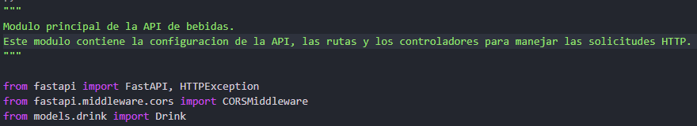
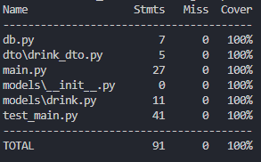

# ANÁLISIS ESTÁTICO DEL CÓDIGO - BEBIDAS CON FASTAPI

## Descripción
Este documento contiene el reporte del análisis estático realizado al proyecto **API_BEBIDAS** utilizando herramientas como **Pylint**, **Mypy** y **Coverage.py**.

## Herramientas Utilizadas
- **Pylint**: Para verificar la calidad del código y adherencia a PEP 8.
- **Mypy**: Para análisis de tipos estáticos.
- **Coverage.py**: Para medir la cobertura de pruebas.

## Reporte Realizado con Pylint
**Pylint** es una herramienta de análisis estático de código para Python que verifica la calidad del código, asegurándose de que cumpla con las convenciones de estilo definidas en PEP 8 (guía oficial de estilo para python).

Entre algunas de las advertencias que pylint identifica se encuentran errores comunes como variables no utilizadas, importaciones incorrectas o mal ordenadas, problemas de diseño como clases con demasiados métodos o funciones demasiado complejas, entre otros.

Por otro lado, para poder ejecutar pylint en un proyecto de python, es necesario instalar con el gestor de librerias pip la dependencia de pylint, como se puede ver en el siguiente comando:

```
pip install pylint
```

Posteriormente, se puede ejcutar el siguinte comando en la consola para llevar a cabo el análisis estático del código con pylint:

```
pylint main.py test_main.py db.py models/ dto/ -> Se colocan los nombres de los modulos y los paquetes a los cuales se les quiere analizar el código con pylint.
```

En la siguiente imagen se pueden ver las advertencias encontradas en la calidad del código, junto con una calificación global del mismo:


### **- Módulo main:**

**1. Missing module docstring:**

Esta fue una de las advertencias mas reiterativas en los módulos que fueron analizados por **Pylint**, y la cual se refiere a que hacen falta docstrings o comentarios en formato de cadena que describan el proposito de un módulo, clase o método. En este caso se corrigio la advertencia referente a la falta de docstrings en el módulo analizado.

```
main.py:1:0: C0114: Missing module docstring (missing-module-docstring)
```

La anterior advertencia se corrigio agregando un comentario (docstring) al principio del módulo main:



También se agregaron los comentarios correspondientes a cada uno de los métodos que hay en el módulo main, siguiendo un proceso similar al mencionado anteriormente.

```
main.py:21:0: C0116: Missing function or method docstring (missing-function-docstring)
main.py:34:0: C0116: Missing function or method docstring (missing-function-docstring)
main.py:40:0: C0116: Missing function or method docstring (missing-function-docstring)
```

**2. Third party import:**

Esta advertencia se refiere a que la importación del módulo que permite configurar el CORS en la aplicación de FastAPI, al ser de un tercero, debe de estar ubicado antes de los imports de módulos propios.

```
main.py:3:0: C0411: third party import "fastapi.middleware.cors.CORSMiddleware" should be placed before first party import "models.drink.Drink"  (wrong-import-order)
```

La corrección a la anterior advertencia se puede ver en la siguiente imagen:


**3. Ungrouped-imports:**

Esta advertencia hace referencia a que las importaciones del paquete de FastAPI no se encuentran agrupadas, por lo que las importaciones de un mismo paquete siempre deben de estar agrupadas entre ellas.

```
main.py:3:0: C0412: Imports from package fastapi are not grouped (ungrouped-imports)
```

La corrección de la anterior advertencia se hizó de la siguiente forma.


### **- Módulo db:**

**1. Trailing whitespace:**

Esta advertencia indica que en la línea 10 del módulo db hay un espacio en blanco entre las líneas de código, por lo que esta se soluciona borrando los espacios que hay demás.

```
db.py:10:25: C0303: Trolling whitespace (trailing-whitespace)
```

**2. Missing Final Newline:**

Esta advertencia se presenta cuando no se termina el código de un módulo con un salto de línea, por lo que este se resuelve agregando el salto de línea.

```
db.py:16:0: C0304: Final newline missing (missing-final-newline)
```

A parte de las anteriores advertencias, también se corrigieron aquellas relacionadas con los docstrings.

### **- Módulo drink**:

En este módulo también se corrigieron las advertencias sobre la falta de docstrings. 

### **- Módulo drink_dto**:

**1. Invalid Name:**

Esta advertencia se presenta cuando el nombre de un archivo, no cumple con el formato de snake_case recomendado, por lo que esta advertencia se corrigió cambiando el nombre del archivo DrinkDTO por drink_dto.

```
dto\DrinkDTO.py:1:0: C0103: Module name "DrinkDTO" doesn't conform to snake_case naming style (invalid-name)
```

También en este módulo se corrigieron las advertencias relacionadas con la falta de docstrings.

### **Reglas desactivadas**

#### **- Módulo drink**:

**1. Too few public methods:**

Esta advertencia hace referencia a que la clase Drink que esta dentro del modulo drink tiene muy pocos métodos públicos, en este caso tiene 0/2, ya que Pyliny espera que las clases definidas tengan por lo menos dos métodos públicos que se puedan utilizar. Sin embargo, esta regla se desactivo debido a que la clase Drink es un modelo de la libreria SQLAlchemy, en donde esta ya tiene una estructura con méotodos predefinidos, por lo que no es necesario agregar más métodos a los que ya tiene la clase base.

```
models\drink.py:7:0: R0903: Too few public methods (0/2) (too-few-public-methods)
```

La forma en la que se desactivo la advertencia fue la siguiente:


Por último, al volver a ejecutar el comando de pylint, se obtuvo el siguiente resultado:


## Reporte Realizado con Mypy
**Mypy** es una herramienta de análisis estático de código para Python que verifica la consistencia de tipos en el código, y aunque este lenguaje de programación tiene un tipado dinámico, es posible agregar anotaciones de tipo al código y verificar que los tipos sean consistentes en el tiempo de desarrollo.

Así mismo, esta permite detectar errores antes de ejecutar el código, contribuyendo a la mejora de la calidad y mantenibilidad de un proyecto.

Para poder ejecutar mypy en un proyecto de python, es necesario instalar con el gestor de librerias pip la dependencia de mypy, como se puede ver en el siguiente comando:

```
pip install mypy
```

Luego de haber instalado la dependencia de mypy, se puede ejecutar el análisis de la consistencia de tipos en el código con el siguiente comando:

```
mypy main.py models/ db.py dto/ test_main.py -> Se deben de colocar todas los archivos y carpetas en los que se quiere analizar la consitencia de tipos en el código

mypy --explicit-package-bases main.py models/ db.py dto/ test_main.py -> Si se desea que mypy interprete que cada carpeta del proyecto es un paquete específico, se debe de usar este comando.
```

El resultado obtenido del análisis se muestra por consola, como se puede ver en la siguiente imagen:


### **- Módulo models/drink**:

**1. Variable is not valid as a type [valid-type]:**

Este error se presente debido a que mypy no reconoce la clase Base como un tipo válido, esto a causa de que SQLAlchemy utiliza una clase dinámica para definir esta clase, por lo que, no es compatible con el sistema de tipos de mypy.

```
models\drink.py:12: error: Variable "models.drink.Base" is not valid as a type  [valid-type]
models\drink.py:12: note: See https://mypy.readthedocs.io/en/stable/common_issues.html#variables-vs-type-aliases
models\drink.py:12: error: Invalid base class "Base"  [misc]
```

El código que se tiene actualmente es el siguiente:


La forma en que se corrigio el error es la siguiente:


De esta forma la clase Base se define como una clase de tipo estático.

### **Reglas desactivadas**:

**1. Cannot assign to a method [method-assign]:**

Esta error se presenta porque en el archivo test_main.py se esta intentando asignar un valor a un método, sin embargo, la forma en que se esta asignando el objeto MagicMock al session.query es correcta, por lo que se decidió desactivar la regla de la siguiente forma:


Por último, al volver a ejecutar el comando de mypy, no se encontraron mas erorres de consistencia de tipos: 


## Reporte Realizado con Coverage-py
**Coverage.py**es una herramienta de análisis estático de código que permite verificar que partes del código han sido ejecutadas durante la ejecución de pruebas y cuales no, permitiendo identificar las áreas del código que no se están probando.

Para instalar esta herramienta en un proyecto de python se puede hacer uso del gestor de librerias pip, como se puede ver a continuación:

```
pip install coverage
```

Por otro lado, para realizar la ejecución de las pruebas se debe de escribir el siguiente comando en la terminal:

```
coverage run -m pytest
```

Luego de haber ejecutado con coverage la cobertura de código en los archivos de pruebas, se puede mostrar el resultado en la terminal o se puede generar un archivo .html con los resultados de dicha ejecución:

**- Mostrar resultados de las pruebas en la terminal:**
```
coverage report
```

**- Exportar un archivo html con los resultados de la ejecución:**

Para poder visualizar los resultados del análisis de cobertura con el archivo html, se debe de abrir la carpeta htmlcov y dentro de esta abrir en un navegador el archivo index.html, de esta forma se cargaran todos los estilos y la información del reporte generado.

```
coverage html
```

El resultado obtenido de la ejecución se puede observar en la siguiente tabla:



En esta tabla la columna **Name** se refiere al nombre del archivo que fue analizado, **Stmts** (Staments) es el número total de sentencias (líneas de código ejecutable) que hay en el archivo, **Miss** es el número de sentencias que no fueron ejecutadas durante todas las pruebas de pytest, y **Cover** es el porcentaje de cobertura del código ejecutable, es decir, el porcentaje de sentencias ejecutadas durante las pruebas.

Los resultados obtenidos de la prueba de cobertura es que de las 91 sentencias de código ejecutable que fueron analizadas, el 100% fueron ejecutadas con las pruebas, esto también se debe a que ya se han implementado las sugerencias hechas por pylint y mypy.